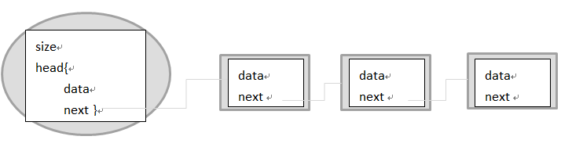

## 单链表

[源代码](../../src/dataStructure/SingleLinkedList/SingleLinkedListDemo.java)

### 定义
单链表是一种链式存取的数据结构，用一组地址任意的存储单元存放线性表中的数据元素。
链表中的数据是以结点来表示的，每个结点的构成：元素(数据元素的映象) + 指针(指示后继元素存储位置)，元素就是存储数据的存储单元，指针就是连接每个结点的地址数据。

### 算法复杂度分析

####时间复杂度：
* addAtHead： **O(1)**
* addAtInder，get，deleteAtIndex: **O(k)**，其中 k 指的是元素的索引。
* addAtTail：**O(N)**，其中 N 指的是链表的元素个数。

####空间复杂度：
  * 所有的操作都是 **O(1)**。


### 编码目的

1. get(index)：获取链表中第`index`个节点的值。如果索引无效，则返回-1。
2. addAtHead(val)：在链表的第一个元素之前添加一个值为`val`的节点。插入后，新节点将成为链表的第一个节点。
3. addAtTail(val)：将值为`val`的节点追加到链表的最后一个元素。
4. addAtIndex(index,val)：在链表中的第`index`个节点之前添加值为`val`的节点。如果`index`等于链表的长度，则该节点将附加到链表的末尾如果 index 大于链表长度，则不会插入节点。如果`index`小于0，则在头部插入节点。
5. deleteAtIndex(index)：如果索引`index`有效，则删除链表中的第`index`个节点。

### 思路

1. 跟据链表的定义，我们可以很轻易的理解问题
2. 难点在于编码上
3. 我们需要一个头部节点用于管理整个链表，这个头部节点就代表了整个链表，我们添加删除操作都可以通过访问头部节点然后遍历节点完成操作。
4. 创建一个伪头部，不存放数据。只用于管理链表，链表中的每一个节点都是next属性等于下一个节点的地址 `linkNode.next= nextlinkNode`。
5. 每一个节点就是一个对象，添加新节点就是将linkNode.next等于匿名对象的地址，这样便可以保存地址了


### 主要功能实现思路
* 初始化
  * 需要为两个类一个节点类，用于存放数据和下一个节点的地址 `class linkNode`
  * 另一个类用于管理我们的节点。`MyLinkedList`
  * MyLinkedList类需要size属性和head属性方便后面的方法访问
  * 实例化head,head不需要存放数据，head是用于连接链表的
   ```java
    int size;
    linkNode head;
    public MyLinkedList() {
        size = 0;
        head = new linkNode(0);
    }
  ```

* 获取链表中第 **index** 个节点的值 `get(index)`
  * 判断index是否异常
  * 因为要获取第index个节点的值所有要遍历index次
  * 最后返回data
* 在链表中的第 index 个节点之前添加值为 val  的节点 `addAtIndex(index,val)`
  * 国际惯例先判断index是否有问题
  * 初始化两个指针，curr指针指向head，newNode为新建对象保存数据
  * 遍历链表，因为要在index之前添加数据所有for循环的次数应该是index-1次
  * 将newNode.next = curr.next
  * curr.next = newNode 
* 在链表的第一个元素之前添加一个值为 val 的节点`addAtHead(val)`
* 将值为 val 的节点追加到链表的最后一个元素 `addAtTail(val)`
  * 在头部添加节点和在尾部添加节点其实可以调用`addAtIndex(index,val)`便可以解决
  * 添加到尾部`addAtIndex(size,val)`
  * 添加到头部`addAtIndex(0,val)`
* 删除链表中的第 index 个节点 `deleteAtIndex(index)`
  * 找到要删除节点的前一个节点。
  * 通过改变 next 来删除节点。
  
### 拓展算法
* [反转单链表](../algorithm/reverseList.md)
